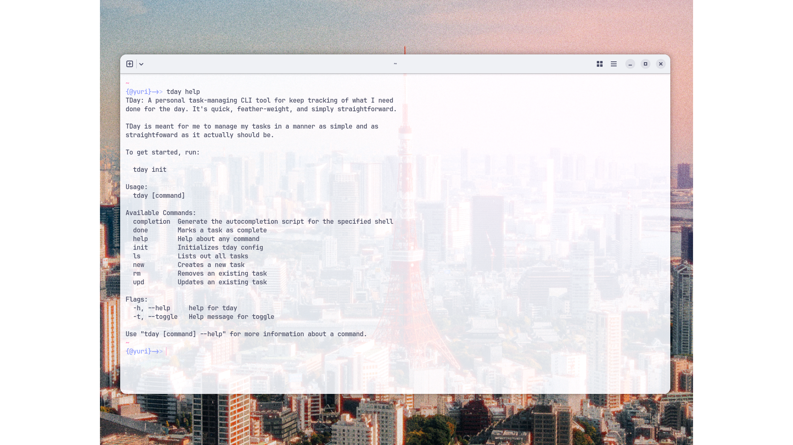
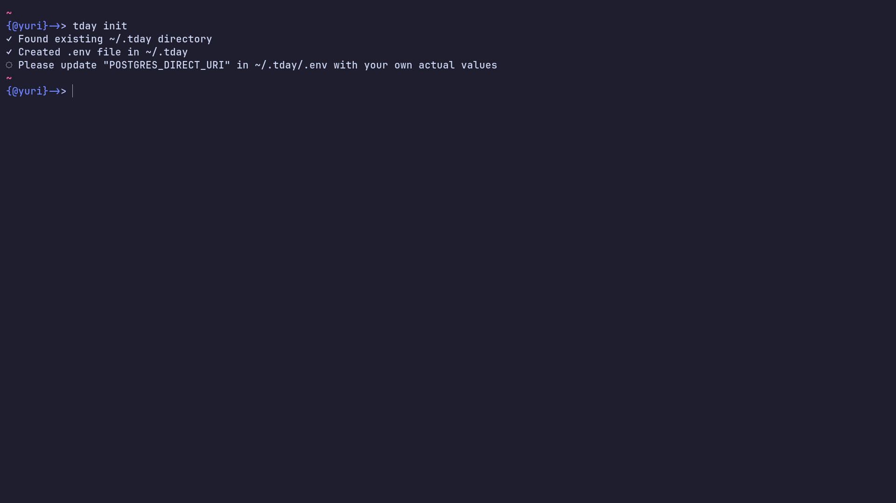
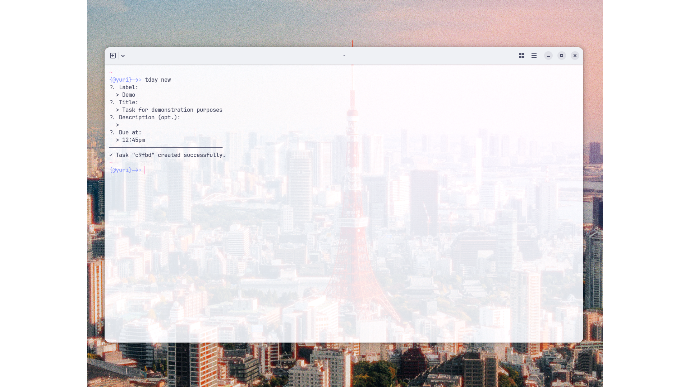
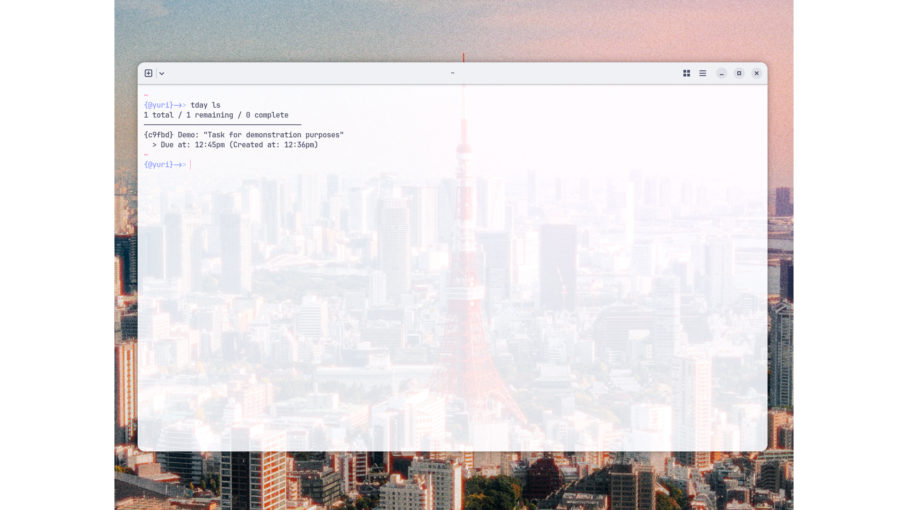
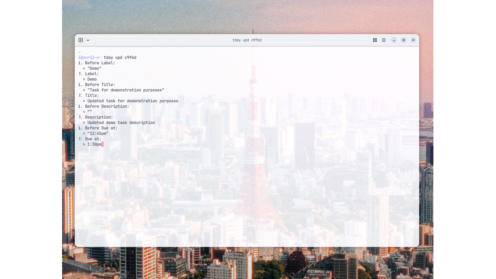
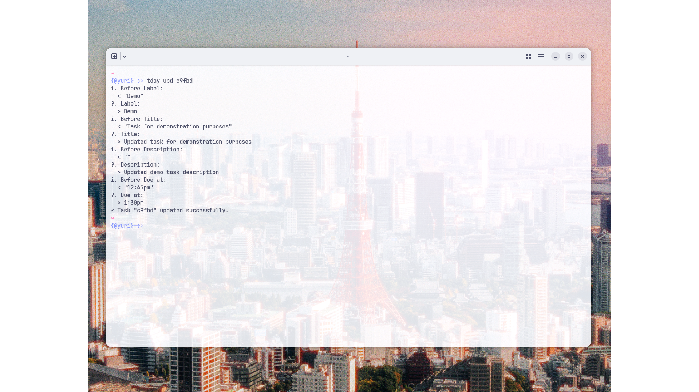
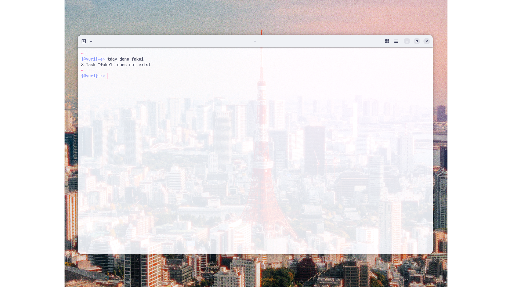
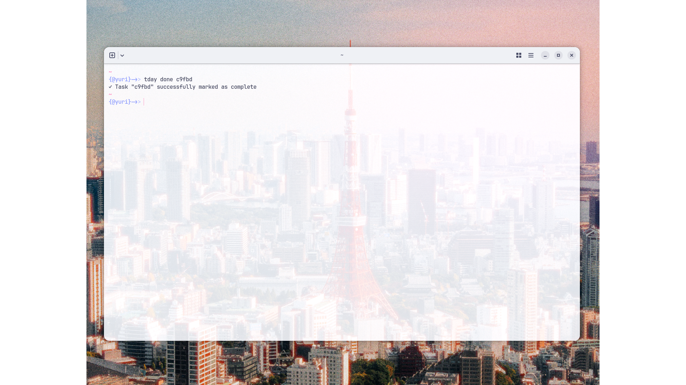

# Preview

## Commands

### Help

### Init

Initialize:

Already initialized:

### Demo

#### Creation

Progress:

Success:

#### Reads

Error:

Success:

#### Updates

Error:

Progress:

Success:

#### Complete

Error:

Success:

#### Deletion

Error:

Success:

